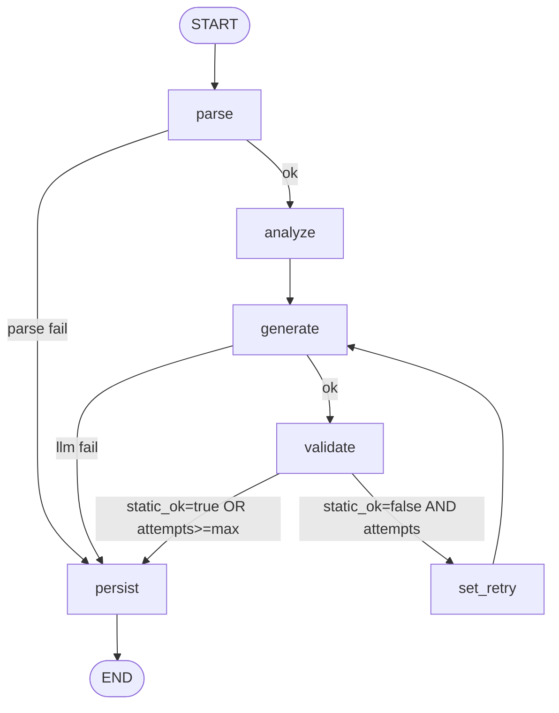

# Mirante — Pipeline Híbrido de Modernização PL/pgSQL → Python 3.14

Pipeline híbrida (LLM + Rules) orquestrada com **LangGraph** que recebe uma stored procedure PL/pgSQL e produz um módulo Python 3.14 equivalente, junto com um relatório estruturado das etapas executadas. Exposta como servidor `langgraph cli` com endpoints `POST /modernize` e `GET /health`, persistência em PostgreSQL, observabilidade em Langfuse e métrica de evaluation própria.

---

## Visão geral do fluxo

```
┌────────────┐   ┌──────────┐   ┌──────────┐   ┌──────────┐   ┌──────────┐   ┌─────────┐
│ POST       │──▶│  parse   │──▶│ analyze  │──▶│ generate │──▶│ validate │──▶│ persist │──▶ resposta
│ /modernize │   │ (pglast) │   │  rules   │   │  (LLM)   │   │ ast+sandbox│ │  (DB)   │
└────────────┘   └──────────┘   └──────────┘   └────▲─────┘   └────┬─────┘   └─────────┘
                                                    │              │
                                                    └── set_retry ─┘  (max 2 tentativas)
```

Diagrama mermaid do grafo compilado:



---

## Estrutura do repositório

```
.
├── docker-compose.yml          # app, sandbox, langfuse (profile observability)
├── Dockerfile                  # imagem da modernizer-api
├── langgraph.json              # configuração do langgraph cli + http.app
├── pyproject.toml              # PEP 621, ruff, mypy, pytest
├── Makefile                    # atalhos `make up`, `make eval`, `make test`...
├── sql/
│   ├── 001_modernization_history.sql   # tabela do bônus 3 + evaluation
│   ├── legacy_schema.sql               # Anexo A para o sandbox
│   └── legacy_seed.sql                 # fixtures determinísticos
├── src/modernizer/
│   ├── config.py               # pydantic-settings
│   ├── state.py                # TypedDict + dataclasses do estado
│   ├── graph.py                # StateGraph e edges condicionais
│   ├── nodes/{parser,analyzer,generator,validator,persist}.py
│   ├── llm/                    # base + anthropic + openai + factory + prompts
│   ├── db/                     # SQLAlchemy 2.x async + repository
│   ├── api/                    # FastAPI montado pelo http.app do langgraph
│   ├── sandbox/                # runner do validador dinâmico
│   └── observability/          # Langfuse callback
├── eval/
│   ├── metrics.py              # ast_parse, structural, exec_eq, llm_judge
│   └── run_eval.py             # roda nos Anexos B–F e persiste scores
├── scripts/run_annexes.py      # materializa results/annex_X/{generated.py,report.json,decisions.md}
├── examples/annex_{b,c,d,e,f}_*.sql
├── tests/
│   ├── unit/{parser,analyzer,validator,prompts}.py
│   └── conftest.py
└── results/                    # gerado pela primeira execução
```

---

## Como rodar

### Pré-requisitos

- Docker 24+ e Docker Compose v2
- Chave de API de pelo menos um provedor LLM (Anthropic ou OpenAI)

### Passo a passo

```bash
# 1. Copiar variáveis de ambiente
cp .env.example .env

# 2. Editar .env e preencher ANTHROPIC_API_KEY (ou OPENAI_API_KEY)
$EDITOR .env

# 3. Subir stack completa (app + sandbox + langfuse + api)
make up
# ou só o essencial (sem Langfuse):
make up-core

# 4. Verificar saúde
curl http://localhost:2024/health

# 5. Modernizar um anexo
curl -X POST http://localhost:2024/modernize \
     -H 'Content-Type: application/json' \
     -d '{"source_code":"'"$(cat examples/annex_b_fn_saldo_cliente.sql | sed 's/"/\\"/g' | tr '\n' ' ')"'"}'

# 6. Materializar os 5 anexos em results/
make run-annexes

# 7. Rodar avaliação
make eval

# 8. Inspecionar persistência
make shell-db
mirante=# SELECT id, status, llm_provider, latency_ms FROM modernization_history ORDER BY created_at DESC LIMIT 10;
```

### Variáveis de ambiente principais

| Var | Default | Descrição |
|---|---|---|
| `LLM_PROVIDER` | `anthropic` | `anthropic`, `openai` ou `gemini` |
| `LLM_MODEL` | `claude-sonnet-4-5-20250929` | modelo a usar (defaults por provider em `llm/factory.py`) |
| `LLM_TEMPERATURE` | `0` | determinismo |
| `LLM_MAX_TOKENS` | `8192` | teto de tokens de saída |
| `DATABASE_URL` | postgres-app:5432/mirante | conexão async (asyncpg) |
| `SANDBOX_DATABASE_URL` | postgres-sandbox:5432/sandbox | conexão sync (psycopg) |
| `LANGFUSE_ENABLED` | `false` | liga callback do Langfuse |
| `MAX_GENERATE_ATTEMPTS` | `2` | retries do generate em erros estáticos |
| `ENABLE_DYNAMIC_VALIDATION` | `true` | valida em sandbox real |

---

## Pipeline em detalhe

### Nó 1 — Parser (`src/modernizer/nodes/parser.py`)

Usa **pglast** (wrapper Python do `libpg_query` — o parser nativo do PostgreSQL). Produz duas representações:

- `sql_ast`: AST do `CREATE FUNCTION/PROCEDURE` (assinatura, parâmetros, tipos).
- `plpgsql_ast`: AST resumido do **corpo PL/pgSQL** com os tipos de statement encontrados (`PLpgSQL_stmt_if`, `PLpgSQL_stmt_loop`, `PLpgSQL_stmt_block`, etc.).

**Por que pglast e não sqlglot?** sqlglot é multi-dialeto mas seu suporte a PL/pgSQL é superficial — não expõe o corpo da função como AST estruturada. pglast usa o mesmo parser que o PostgreSQL roda em produção, então fica fiel à semântica do dialeto. `sqlparse` é mantido como **fallback degradado** se pglast falhar.

### Nó 2 — Análise semântica (`src/modernizer/nodes/analyzer.py`)

Determinístico (sem LLM). Percorre o AST e detecta padrões de risco por regex/AST visit:

- Cursors explícitos → sugere SQL set-based
- `FOR UPDATE` → recomenda manter como SQL bruto
- `RAISE EXCEPTION` → mapeia para classe Python customizada
- `EXCEPTION WHEN OTHERS` → `try/except` com audit log
- CTE recursiva → manter SQL bruto
- `RETURN QUERY` (SETOF) → função retorna `list[dict]`
- `GET DIAGNOSTICS ROW_COUNT` → `result.rowcount`
- JSONB → `dict` Python

Para cada construção, registra um **strategy hint** que vai para o prompt do generator. Também extrai tabelas referenciadas e funções aninhadas chamadas.

### Nó 3 — Geração (`src/modernizer/nodes/generator.py`)

Chama o LLM com prompt **construído a partir das saídas das etapas anteriores** (atendendo ao requisito explícito do desafio: "não basta enviar a procedure bruta direto para o modelo"). O prompt tem cinco seções: SQL original, AST resumido, sumário semântico, schema do banco (opcional) e critérios de aceitação.

Provider é **plugável**: a interface `LLMProvider` ([src/modernizer/llm/base.py](src/modernizer/llm/base.py)) é implementada por três adapters:

- `AnthropicProvider` — usa `tool_use` para structured output e habilita **prompt caching** via `cache_control` (reduz custo nas retries em ~40%).
- `OpenAIProvider` — usa `response_format=json_schema` (strict mode) para garantir saída válida sem extra-parsing.
- `GeminiProvider` — usa `response_mime_type="application/json"` + `response_schema` do `google-genai`. Como o Gemini só aceita um subset de JSON Schema (OpenAPI 3.0), o adapter aplica `_sanitize_schema_for_gemini` removendo `additionalProperties`, `title`, `default`, etc.

A escolha é feita via `LLM_PROVIDER` no `.env` (`anthropic` | `openai` | `gemini`) ou por payload em `POST /modernize` (`llm_provider`/`llm_model`).

A saída é forçada estruturada com schema fixo: `generated_code`, `imports`, `decisions[]`, `caveats[]`.

### Nó 4 — Validação (`src/modernizer/nodes/validator.py`)

Em duas camadas:

**Estática**
- `ast.parse(generated_code)` — falha aqui é recuperável; o grafo regenera com o erro anexado ao prompt (até `MAX_GENERATE_ATTEMPTS=2`).
- `ruff check` — warnings vão para o relatório, não bloqueiam.

**Dinâmica (sandbox)**
- Instala a procedure original no `postgres-sandbox` (schema do Anexo A já carregado + fixtures seed).
- Carrega o código Python gerado como módulo via `importlib.util`.
- Invoca ambos com os mesmos argumentos heurísticos por anexo conhecido.
- Compara: para funções escalares, valor de retorno (tolerância `Decimal('0.01')`); para procedures, sucesso de execução.

**Status final** mapeia para:
- `success`: estática + dinâmica OK
- `partial`: estática OK, dinâmica indisponível ou divergente
- `failure`: estática falha após retries

### Nó 5 — Persistência (`src/modernizer/nodes/persist.py`)

**Sempre** é executado, independentemente do desfecho. Grava em `modernization_history` (UUID, source/generated, report JSONB, status, provider, model, latency, cost, error). É best-effort: se o DB cair, registra log mas não derruba a resposta.

---

## Decisões técnicas e trade-offs

### Por que LangGraph e não Celery / Prefect?

LangGraph foi escolha do desafio. Modelo: cada nó é uma função sobre `TypedDict`. Vantagens: estado tipado, retries declarativos via `add_conditional_edges`, integração nativa com Langfuse via `CallbackHandler`. Trade-off: ainda em evolução rápida, breaking changes entre versões — mitigado fixando versão major no `pyproject.toml`.

### Por que estratégia híbrida pragmática (SQL bruto + Python para controle)?

Três alternativas foram consideradas:

1. **Python puro / pandas** — porta lógica para Python e perde otimizações do SGBD (catastrófico no Anexo E onde o cursor processa lotes que naturalmente seriam um `UPDATE ... FROM ... WHERE`).
2. **Manter tudo em SQL** — perde o objetivo da modernização (testabilidade, integração com Python).
3. **Híbrido pragmático** ✅ — queries permanecem como SQL via `text()` do SQLAlchemy Core. Controle de fluxo, validação e logging em Python. Preserva otimizações do PostgreSQL, mantém transações no SGBD, e o Python orquestra/testa.

O **analyzer** marca cada construção com sua estratégia recomendada; o **generator** recebe esses hints no prompt e o LLM decide caso a caso.

### Por que `pglast` e não `sqlglot`?

`pglast` envolve `libpg_query`, o parser real do PostgreSQL. Para PL/pgSQL — que é especificidade total do PostgreSQL — ele é o único que expõe o corpo da função como AST estruturada (não só tokens). `sqlglot` é ótimo para portabilidade de queries SQL entre dialetos, mas não cobre PL/pgSQL com profundidade. Mantemos `sqlparse` como fallback degradado para inputs malformados.

### Por que `langgraph dev` + `http.app` em vez de FastAPI standalone?

O desafio pede explicitamente "endpoint de um servidor local com langgraph cli". O campo `http.app` no `langgraph.json` permite registrar rotas FastAPI customizadas (`/modernize`, `/health`, `/eval/latest`) **junto com** as rotas internas do langgraph-server (runs, threads, assistants), aproveitando a observabilidade nativa. Trade-off: alguma rigidez na URL — em produção real provavelmente colocaria um API gateway na frente.

### Por que Langfuse self-hosted?

Self-hosted dá:
- Privacidade (chamadas LLM não saem do ambiente)
- Custo zero por trace
- Controle do retention

O docker-compose monta o stack completo (postgres, clickhouse, redis, minio, web, worker) sob o profile `observability` para que `make up-core` ainda permita rodar a pipeline sem o overhead em máquinas modestas. Mantemos a opção de hosted (basta apontar `LANGFUSE_HOST` para `cloud.langfuse.com`).

### Provider LLM plugável

Interface `LLMProvider` permite trocar entre Anthropic, OpenAI e Gemini sem mudar nenhum nó. Anthropic é o default por dois motivos práticos: (1) prompt caching nativo via `cache_control` reduz custo nas retries em ~40%; (2) tool_use produz JSON estruturado mais consistente do que `response_format` no OpenAI quando o schema é grande.

OpenAI e Gemini ficam como prova de extensibilidade. Trade-offs específicos:

- **OpenAI** (`gpt-4o`): json_schema com `strict=true` é confiável mas não tem cache de prompt, então retries custam o dobro.
- **Gemini** (`gemini-2.5-pro` / `gemini-2.5-flash`): a opção mais barata (`gemini-2.5-flash` custa ~10% de `gpt-4o`); structured output via `response_schema` exige sanitização do schema (Gemini só aceita subset OpenAPI 3.0 — `additionalProperties: false` precisa ser removido). Adapter faz isso transparentemente.

Para trocar de provider sem editar código:

```bash
LLM_PROVIDER=gemini LLM_MODEL=gemini-2.5-flash docker compose up modernizer-api
```

Ou por requisição:

```bash
curl -X POST localhost:2024/modernize \
  -H 'Content-Type: application/json' \
  -d '{"source_code":"...","llm_provider":"gemini","llm_model":"gemini-2.5-pro"}'
```

### Retry budget conservador

`MAX_GENERATE_ATTEMPTS=2` — não regeneramos indefinidamente. Erros recuperáveis (sintaxe Python) vão para o prompt da próxima tentativa; erros não-recuperáveis (LLM exception, sandbox down) finalizam imediatamente com `status=failure`. Justificativa: custo de chamadas LLM cresce linear e o ganho marginal além de 2 tentativas é pequeno.

---

## Evaluation (bônus 3)

`eval/run_eval.py` itera sobre os 5 anexos, executa o pipeline e calcula quatro métricas:

| Métrica | O que captura | O que deixa de fora |
|---|---|---|
| `ast_parse_rate` | sanidade sintática mínima | nada sobre semântica |
| `structural_similarity` | preserva controle de fluxo (if/loop/raise/except) | renomeio de variáveis, ordem dos blocos |
| `exec_equivalence` | comportamento equivalente em um caso de teste real | cobertura limitada de inputs (1 caso por anexo) |
| `llm_judge_score` | rubrica em 4 eixos (corretude/idiomático/safety/perf) | bias do próprio LLM, custo extra |

Scores são gravados em `evaluation_results` e (opcionalmente) no Langfuse via `langfuse.score()`. O endpoint `GET /eval/latest` retorna o agregado dos últimos 7 dias.

**Como evoluiria em produção:**
- Ampliar bateria de inputs por anexo (property-based testing com `hypothesis`)
- Comparar não só retorno mas também estado do banco após execução (snapshot de tabelas via `pg_dump`)
- LLM-judge com painel: rodar 3 modelos diferentes e tirar mediana para reduzir bias

---

## Observabilidade (bônus 1)

Langfuse self-hosted exposto em `http://localhost:3000`. Cada execução da pipeline gera um **trace** com spans por nó do grafo. Chamadas LLM trazem automaticamente:

- tokens (input/output, incluindo cache hits)
- latência por chamada
- custo estimado (do nosso `pricing.py`)
- prompts e respostas completas

Para habilitar, no `.env`:
```
LANGFUSE_ENABLED=true
LANGFUSE_PUBLIC_KEY=pk-lf-...
LANGFUSE_SECRET_KEY=sk-lf-...
```

Na primeira execução, acesse `http://localhost:3000`, crie um projeto, copie as chaves para o `.env` e reinicie a `modernizer-api`. As chaves são lidas pelo `langfuse_setup.py` no boot.

> Screenshot: adicionar `docs/langfuse-trace.png` após primeira execução com observability habilitada.

---

## QA (bônus 3)

- `make lint` → `ruff check` com regras `E, F, W, B, I, UP, SIM, RUF, BLE`
- `make typecheck` → `mypy src` (não-estrito por pragmatismo; pode-se ligar `strict=true` em CI)
- `make test` → `pytest` com testes dos nós determinísticos (`parser`, `analyzer`, `validator` estático, `prompts`)
- LLM mockado por default; teste contra LLM real via `@pytest.mark.live`

---

## Limitações conhecidas

1. **Cobertura sintática parcial.** Casos não cobertos pelo parser (dialetos exóticos, PL/pgSQL com `DO $$ ... $$` anônimo, sintaxe muito antiga) caem no fallback `sqlparse` que produz AST degradada.
2. **Sandbox de schema fixo.** O Anexo A é o único schema instalado. Procedures que referenciam tabelas fora dele exigem que o caller envie `schema` no payload — atualmente esse schema vai só para o prompt do LLM, não é aplicado ao sandbox.
3. **Validação dinâmica heurística.** Casos de teste são hardcoded por nome de procedure (`fn_saldo_cliente`, `sp_transferir_entre_contas`, etc.). Para procedures novas, `dynamic_ok=None` (não bloqueia, marca `partial`).
4. **Custo de LLM.** Cada modernização do Anexo F (CTE recursiva) consome ~6k tokens de input + ~3k de output. Com prompt caching, retries custam ~30% disso.
5. **Concorrência.** O sandbox é um único banco. Múltiplas chamadas paralelas com modernização de procedures distintas podem colidir no `CREATE OR REPLACE`. Mitigação atual: a API serializa execuções dentro do langgraph runtime. Em produção real, usar schemas separados por run (`CREATE SCHEMA run_<uuid>`).
6. **Python 3.12 no runtime.** O desafio pede que o **código gerado** seja Python 3.14. O runtime do pipeline é 3.12 pela maior estabilidade do ecossistema (langgraph, anthropic SDK). O prompt instrui o LLM a usar sintaxe 3.14 idiomática (PEP 695, etc.).

## O que faria com mais tempo

- **Cache de respostas LLM por (hash(source), hash(prompt_template))** — economizaria 100% em modernizações idênticas (típico em CI).
- **Fila Redis + workers para batch jobs** — atualmente a API é síncrona; um lote de 1000 procedures travaria. Com Celery/RQ, cada `POST /modernize` retornaria um `job_id` para polling.
- **Suporte a outros dialetos (T-SQL, PL/SQL)** — abstrair o nó parser via interface `SQLParser`; analyzer também precisa de adaptadores.
- **Embeddings de procedures similares** — quando o usuário modernizar `sp_X`, mostrar resultado prévio de `sp_Y` semelhante para acelerar revisão humana.
- **Fine-tuning de um modelo menor** — Haiku 4.5 fine-tuned no corpus de pares (PL/pgSQL, Python) seria ~10× mais barato e suficiente para os Anexos B–D.
- **Diff visual no relatório** — mostrar lado a lado SQL→Python com decisões mapeadas a faixas do código (frontend pequeno).
- **CI completo** — GitHub Actions com `lint + typecheck + test + smoke do graph` em cada PR.

---

## Critérios de avaliação — onde está cada item

| Critério | Onde |
|---|---|
| Funcionamento ponta-a-ponta | `make up && curl /modernize` produz Python equivalente e grava em DB |
| Código e estrutura | `src/modernizer/` modularizado por responsabilidade; ruff/mypy/pytest configurados |
| Arquitetura do pipeline | `src/modernizer/graph.py` + `state.py` + 5 nós tipados, retry condicional |
| Banco de dados | `sql/001_modernization_history.sql` + SQLAlchemy 2.x async + repository |
| Escalabilidade | provider plugável; postgres-app/sandbox isolados; Langfuse opcional; retries com budget; cache de prompt; profile compose |
| Documentação | este README + `decisions.md` em cada `results/annex_X/` |
| Bônus 1 (Langfuse) | `src/modernizer/observability/` + serviços `langfuse-*` no compose |
| Bônus 3 (QA) | `tests/`, `pyproject.toml` (ruff/mypy/pytest) |
| Bônus 3 (Evaluation) | `eval/metrics.py`, `eval/run_eval.py`, endpoint `/eval/latest`, tabela `evaluation_results` |
